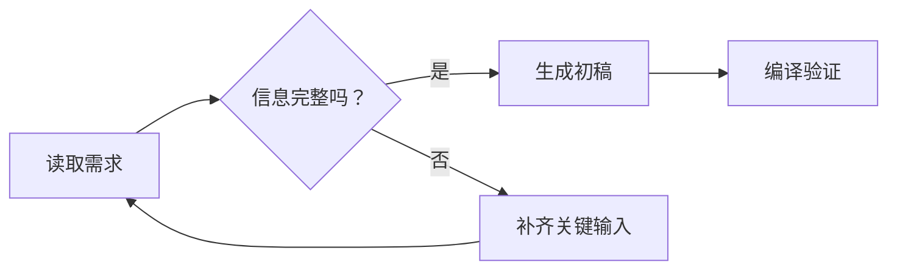

<!-- workbuddy-install: published; slug: lls-mermaid-diagram -->
## 在 WorkBuddy 中找到并安装

**Skill slug：`lls-mermaid-diagram`**

在 WorkBuddy 新会话粘贴：

```text
请按 https://skillhub.cn/install/skillhub.md 检查 SkillHub，搜索 `lls-mermaid-diagram`；仅在 slug 完全一致时安装到 `~/.workbuddy/skills/`。安装后读取 `~/.workbuddy/skills/lls-mermaid-diagram/SKILL.md`，核对 name、version 和实际路径，然后新开会话触发该 Skill。
```

也可以打开左侧「技能」→「添加技能 / 查找技能」，搜索 `lls-mermaid-diagram` 后安装；界面文字可能随 WorkBuddy 版本变化。

# 罗老师 Mermaid 图解助手

## 目标

把“看不懂的一大段话”变成一张能直接用于飞书、Obsidian、GitHub 或演示文稿的结构图。

交付不是一段看似正确的代码，而是：

1. 图型与问题匹配；
2. 用户不读说明也能看懂主线；
3. Mermaid 代码经过实际编译；
4. 同时提供三到五条人话解释；
5. 复杂图可以继续拆分，而不是把所有信息塞进一张图。

## 先判断该画什么图

| 用户问题 | 首选图型 | 不适合的做法 |
| --- | --- | --- |
| 一件事按什么顺序推进 | `flowchart` | 用思维导图堆步骤 |
| 多个系统如何调用 | `sequenceDiagram` | 只画静态方框 |
| 一个对象有哪些状态 | `stateDiagram-v2` | 把状态写成普通流程 |
| 项目任务和时间 | `gantt` | 用节点猜日期 |
| 数据表之间什么关系 | `erDiagram` | 把字段全部放进流程图 |
| 用户从接触到转化 | `journey` 或流程图 | 只有漏斗数字没有动作 |
| 方案分类和组成 | `mindmap` | 强行添加箭头顺序 |

如果用户没有指定图型，先用一句话说明选择理由，然后直接画，不把图型选择题丢回给用户。

## 工作流程

### 1. 提炼一个中心问题

先把材料压缩成一句话，例如：

- “一个 Skill 如何从本地源文件走到三端发布？”
- “用户提交订单后，各系统按什么顺序工作？”
- “这个项目在哪些状态之间切换？”

材料包含多个问题时，先给一张总图，再拆成子图。

### 2. 建立节点清单

每个节点只承担一个意思。优先使用“动作 + 对象”或“角色 + 职责”：

- 好：`检查版本`、`生成安装包`、`用户确认付款`
- 弱：`相关处理`、`其他事项`、一整段解释

单个节点尽量控制在 4–12 个汉字。详细说明放在图后，不塞进节点。

### 3. 明确连接含义

- 顺序：`A --> B`
- 条件：`A -->|通过| B`
- 失败返回：`A -->|失败| C`
- 异步消息：在时序图使用虚线箭头
- 归属关系：优先使用 `subgraph`

每条边都必须回答“为什么连”和“沿什么条件走”。

### 4. 编写稳健语法

中文节点、空格和特殊字符统一使用双引号：



避免在节点里使用长 URL、HTML、复杂 Markdown 或未转义引号。

### 5. 真实编译

将 Mermaid 代码保存为临时 `.mmd` 文件，执行：

```bash
mmdc -i diagram.mmd -o diagram.svg
```

如果本机 `mmdc` 需要指定浏览器，使用已有 Chrome 可执行文件，不把本机路径写入公开 Skill 或最终图表。

编译失败时：读取错误行 → 缩小到最小失败片段 → 修复引号、括号、关键字或图型语法 → 重新编译。最多连续修复三次；仍失败则保留错误日志和最小复现，不把未验证代码标成完成。

### 6. 做可读性复核

- 主线能否从左到右或从上到下读完？
- 一个节点是否出现两种以上动作？
- 交叉线是否太多？
- 颜色是否承担明确含义，而不是装饰？
- 手机屏幕上是否仍能识别节点？
- 图中名词与用户原文是否一致？

超过 15 个核心节点时，优先拆图。

## 输出格式

1. **一句话结论**：这张图解决什么理解问题。
2. **已验证 Mermaid 代码**。
3. **人话解释**：三到五条。
4. **验证回执**：使用什么命令、是否通过。
5. **可选导出**：SVG 或 PNG 路径（用户需要时）。

## 常见失败

### 图能编译，但看不懂

删掉不影响主线的节点；把背景知识移到图后；为条件边补标签。

### 节点中文字显示异常

检查字体与渲染环境；源代码保持 UTF-8；不要用截图替代可编辑 Mermaid。

### 飞书和 Obsidian 表现不同

使用双方都支持的基础语法；减少实验性配置；以目标平台实际渲染为最终验收。

### 用户要求一张图装下全部内容

先交付一张不超过 12 个主节点的总图，再提供一到三张子图。

## 质量门禁

- [ ] 图型与用户问题匹配；
- [ ] 节点文字短且含义单一；
- [ ] 中文和特殊字符已加引号；
- [ ] 分支条件有标签；
- [ ] Mermaid CLI 实际编译通过；
- [ ] 图后有人话解释；
- [ ] 没有账号、凭证、内部主机或真实客户数据；
- [ ] 目标平台已做渲染抽查，或明确记录尚未抽查。

详细检查表见 [references/diagram-review.md](references/diagram-review.md)。

## 使用入口

- [飞书中文教程](https://m2wlgni9k4.feishu.cn/wiki/Ilv9wdwC8ioW0bke4tMcgodinqg)
- [SkillHub 安装页](https://skillhub.cn/skills/lls-mermaid-diagram)
- [GitHub 源码](https://github.com/PhilRobinluo/ai-coevolution-skills/tree/main/skills/lls-mermaid-diagram)
- [GitHub 1.1.0 安装包](https://github.com/PhilRobinluo/ai-coevolution-skills/releases/download/lls-mermaid-diagram-v1.1.0/lls-mermaid-diagram-1.1.0.zip)

如果这张图帮你更快看懂复杂问题，欢迎给总仓库点一个 Star；需要新版提醒时，请订阅 GitHub Releases。
