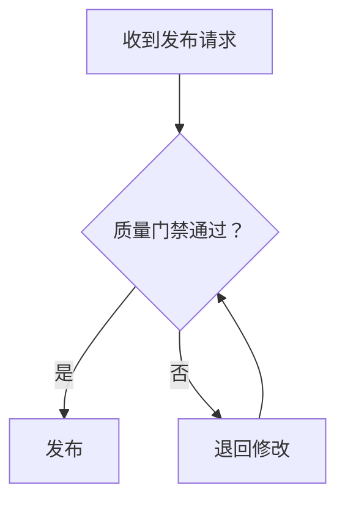

<!-- workbuddy-install: published; slug: lls-mermaid-validator -->
## 在 WorkBuddy 中找到并安装

**Skill slug：`lls-mermaid-validator`**

在 WorkBuddy 新会话粘贴：

```text
请按 https://skillhub.cn/install/skillhub.md 检查 SkillHub，搜索 `lls-mermaid-validator`；仅在 slug 完全一致时安装到 `~/.workbuddy/skills/`。安装后读取 `~/.workbuddy/skills/lls-mermaid-validator/SKILL.md`，核对 name、version 和实际路径，然后新开会话触发该 Skill。
```

也可以打开左侧「技能」→「添加技能 / 查找技能」，搜索 `lls-mermaid-validator` 后安装；界面文字可能随 WorkBuddy 版本变化。

# 罗老师 Mermaid 验证器

> 类型：LLS Original  
> 当前版本：1.1.0
## 一句话用途

把复杂流程变成可读的 Mermaid 图，并用真实编译结果证明它不是“看起来像代码”。

## 先选对图

- `flowchart`：步骤、分支、责任流转。
- `sequenceDiagram`：系统或角色之间按时间发生的消息。
- `stateDiagram-v2`：一个对象的状态与转换条件。
- `classDiagram` / `erDiagram`：结构关系；不拿来硬画时间流程。

## 3 分钟上手

```text
请用 lls-mermaid-validator：先判断该用哪种图；节点 ID 用短英文、中文标签加双引号；给我 Mermaid 源码、编译结果和纯文字版。
```

本地验证：

```bash
bash scripts/validate-mermaid.sh diagram.mmd --output diagram.svg --report validation.txt
```

脚本优先使用本机 `mmdc`，其次使用已经安装在当前项目里的 `npx --no-install mmdc`；不会在验证时偷偷联网安装依赖。

## 标准工作流

1. **明确读者问题**：读者想看顺序、交互、状态还是结构。
2. **压缩信息**：一张图只表达一个主要问题；超过约 12 个核心节点时考虑拆图。
3. **分离 ID 与标签**：`review["人工复核（必做）"]`，ID 简短稳定，展示文案可读。
4. **写转换条件**：分支箭头写清条件，不用“是/否”脱离上下文。
5. **保存 `.mmd` 源文件**：不要只交聊天中的代码块。
6. **真实编译**：输出 SVG/PNG 和报告；失败时保留原错误并定位附近语句。
7. **语义复核**：编译通过不等于逻辑正确，检查漏节点、反向箭头、责任归属和终止状态。
8. **提供文字版**：让未渲染 Mermaid 的环境也能理解流程。

复核表见 [references/compile-and-semantic-review.md](references/compile-and-semantic-review.md)。

## 稳定写法



- 中文、括号、标点较多的标签统一加双引号。
- 不把 `end`、`subgraph` 等保留词当裸 ID。
- 样式是最后一步；先保证结构和含义。
- 图中使用角色、系统类别和占位符，移除 Token、客户名、内网地址。

## 失败处理

- **找不到 mmdc**：报告 `tool_missing`，给安装位置建议，但不把“未验证”写成“通过”。
- **语法错误**：缩小到最小失败片段，再逐段恢复。
- **能编译但难看**：拆图、缩短标签、调整方向；不靠大量 CSS 掩盖结构问题。
- **平台语法版本不同**：记录编译器版本，并提供纯文字版作为可读兜底。

## 验收

交付 `.mmd`、渲染文件、验证报告、文字版。至少确认：命令退出码为 0、输出非空、关键分支都有条件、起点终点清楚、敏感信息已移除。

## 版本记录

- 1.1.0：新增本地依赖策略、真实编译报告、覆盖保护与脚本测试，并强化语义复核。
- 1.0.0：首次公开教学版。

## 三端入口

- GitHub 源码：https://github.com/PhilRobinluo/ai-coevolution-skills/tree/main/skills/lls-mermaid-validator
- GitHub Release：https://github.com/PhilRobinluo/ai-coevolution-skills/releases/tag/lls-mermaid-validator-v1.1.0
- 飞书中文教程：https://m2wlgni9k4.feishu.cn/wiki/FUN1wZmSWigrl3kpEMmcSXkgn2f
- SkillHub：搜索唯一 slug `lls-mermaid-validator`

## 支持项目

如果这个 Skill 帮你节省了时间，欢迎给总仓库点一个 ⭐ Star；需要新版通知时，请使用 Watch Releases：

https://github.com/PhilRobinluo/ai-coevolution-skills
